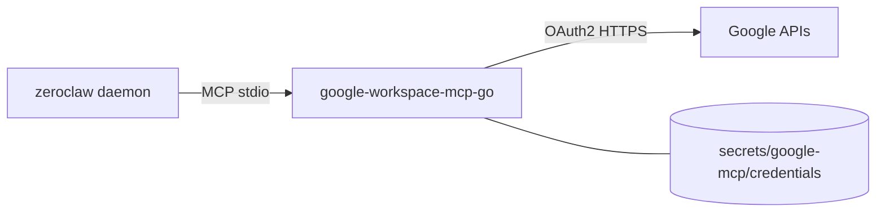

# Google Workspace (Gmail / Calendar / Docs / Drive)

Tim talks to Google through a **compiled Go MCP binary**:
[`magks/google-workspace-mcp-go`](https://github.com/magks/google-workspace-mcp-go)
(stdio, static build, baked into the image like Strava/Garmin).

The built-in ZeroClaw `google_workspace` tool (raw `gws`) is **disabled** —
it rejects camelCase methods such as `batchUpdate`, so Docs writes fail before
they reach Google. Prefer this MCP.



---

## What Tim can do (core tier)

Config loads `--tools gmail drive calendar docs sheets tasks contacts` with
`--tool-tier core` (~45 tools). Useful examples:

| Ask | Tool (approx.) |
|---|---|
| “What’s unread?” | `search_gmail_messages` / `get_gmail_message_content` |
| “What’s on my calendar Friday?” | `get_events` |
| “Update the Seattle itinerary doc” | `modify_doc_text` / `find_and_replace_doc` |
| “Create a sheet of …” | `create_spreadsheet` / `modify_sheet_values` |

Bump to `--tool-tier extended` or `complete` in `config.toml` if you need
rarer ops (then recreate the container).

---

## 1. OAuth client (once)

Reuse the **Desktop** OAuth client you already use for `gws`
(`secrets/google/client_secret.json`), or create one:

1. [Google Cloud Console](https://console.cloud.google.com/) → same project
2. Enable APIs you need (Gmail, Calendar, Docs, Drive, Sheets, Tasks, People, …)
3. OAuth consent (External + your Gmail as test user while in Testing)
4. Credentials → OAuth client ID → **Desktop app**

Put into `.env`:

```env
GOOGLE_OAUTH_CLIENT_ID=….apps.googleusercontent.com
GOOGLE_OAUTH_CLIENT_SECRET=GOCSPX-…
USER_GOOGLE_EMAIL=you@gmail.com
```

---

## 2. Import tokens from existing `gws` export (recommended)

If you already have `secrets/google/credentials.json` from `gws auth export`:

```bash
make google-mcp-import
```

That writes
`secrets/google-mcp/credentials/<USER_GOOGLE_EMAIL>.json` in the MCP’s
on-disk format (refresh token + client id/secret). No browser step.

Then deploy:

```bash
make remote-deploy   # or: make build && make up
```

Send **`/new`** in Telegram so Tim drops the old broken `google_workspace` habit.

---

## 3. Fresh browser auth (only if you have no gws export)

In-container OAuth callbacks bind a **random localhost port**, so remote Docker
auth is awkward. Prefer importing from `gws` (above).

If you must re-consent: run the binary on a machine with a browser, set
`WORKSPACE_MCP_CREDENTIALS_DIR` to this repo’s
`secrets/google-mcp/credentials`, then use an MCP client to call
`start_google_auth` (needs gmail tools + usually `complete` tier for that tool).
Copy the resulting `you@gmail.com.json` into `secrets/google-mcp/credentials/`
and deploy.

---

## 4. Config already wired

```toml
[google_workspace]
enabled = false

[[mcp.servers]]
name = "google-workspace"
transport = "stdio"
command = "google-workspace-mcp-go"
args = ["--tools", "gmail drive calendar docs sheets tasks contacts", "--tool-tier", "core"]

[mcp_bundles.google-workspace]
servers = ["google-workspace"]

[agents.main]
mcp_bundles = ["google-workspace", "strava", "garmin", "google-search"]
```

Compose mounts `./secrets/google-mcp` → `/zeroclaw-data/.config/google-mcp` and
sets `WORKSPACE_MCP_CREDENTIALS_DIR`, `GOOGLE_OAUTH_*`, `USER_GOOGLE_EMAIL`.

---

## Legacy `gws` CLI (optional)

The image still includes `gws` for `docker compose exec` smoke tests. Host auth
export remains useful as the source for `make google-mcp-import`.

Windows export (UTF-8):

```powershell
gws auth login --scopes "https://www.googleapis.com/auth/calendar,https://www.googleapis.com/auth/calendar.events,https://www.googleapis.com/auth/gmail.modify,https://www.googleapis.com/auth/documents,https://www.googleapis.com/auth/drive,https://www.googleapis.com/auth/spreadsheets,https://www.googleapis.com/auth/tasks,https://www.googleapis.com/auth/contacts"
$json = gws auth export --unmasked 2>$null
if (-not $json) { $json = (gws auth export --unmasked | Out-String) }
[System.IO.File]::WriteAllText("$PWD\secrets\google\credentials.json", $json.Trim() + "`n")
```

---

## Troubleshooting

- **Docs write fails with “only lowercase…” / `batchUpdate`** — that’s the
  **built-in** tool. Confirm `[google_workspace] enabled = false` and that Tim
  is using MCP tools (`modify_doc_text`, etc.). `/new` after deploy.
- **MCP auth / 401** — re-run `make google-mcp-import` after a fresh
  `gws auth export`, or re-consent with scopes that include Docs.
- **Tim ignores Workspace MCP** — `mcp_bundles` must include
  `google-workspace`; `[mcp] deferred_loading = false`.
- **Too many tools / context bloat** — keep `--tool-tier core`; drop unused
  services from `--tools`.
- **`gws: not found` / legacy CLI** — rebuild image; MCP path does not need
  `gws` at runtime.
- **Permission denied on secrets/** — readable by `ZEROCLAW_UID` on the server.
